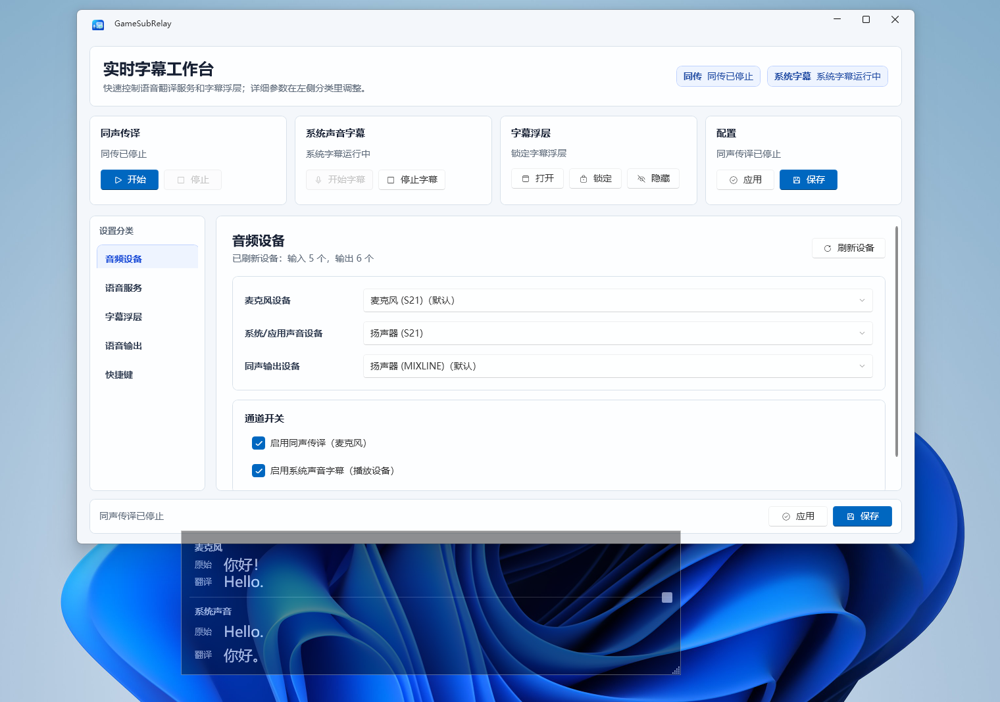

# SubRelay

SubRelay is a Windows desktop live speech translation overlay for microphone and system/application audio.

[中文](README.md) | English



## Features

- Microphone channel: recognize and translate your own speech in real time, with optional translated voice output.
- System audio channel: capture a selected playback device and show both source and translated captions.
- Overlay captions: transparent, always-on-top, and click-through for meetings, livestreams, voice chat, video playback, and games.
- Language settings: configurable source and target languages. The current Volcengine AST implementation includes Chinese, English, Japanese, Indonesian, Spanish, Portuguese, German, French, and Chinese-English translation options.
- Provider-based design: the current live path uses Volcengine Automatic Speech Translation 2.0, while the core interfaces leave room for other real-time speech translation providers.
- Manual control: SubRelay does not start listening automatically. Each channel must be started and stopped explicitly.

## Platform

SubRelay currently targets Windows 10/11. The system audio channel uses Windows WASAPI loopback, which captures the mixed output of the selected playback device rather than a single application or process.

The release package is framework-dependent and requires the .NET 8 Desktop Runtime on the target machine.

## Provider Credentials

For Volcengine Automatic Speech Translation 2.0, get the `APP ID` and `Access Token` from:

https://console.volcengine.com/speech/service/10030

Enter them in the Volcengine AST credentials section on the speech services settings page:

- `APP ID` -> `X-Api-App-Key`
- `Access Token` -> `X-Api-Access-Key`

Do not use account-level IAM AK/SK credentials here. These speech APIs use the `APP ID` and `Access Token` from the speech service page.

## Build Locally

```powershell
dotnet restore GameSubRelay.sln
dotnet build GameSubRelay.sln -c Release
dotnet test GameSubRelay.sln -c Release --no-build
dotnet publish .\src\GameSubRelay.App\GameSubRelay.App.csproj -c Release -r win-x64 --self-contained false -o .\dist\win-x64
```

Or run the repository build script:

```powershell
powershell -NoProfile -ExecutionPolicy Bypass -File .\scripts\build.ps1
```

## Documentation

- AST dual-channel design: `docs/design/ast-dual-channel-design.md`
- Volcengine AST notes: `docs/api/volcengine-ast-translate.md`
- Volcengine ASR diagnostic notes: `docs/api/volcengine-streaming-asr.md`
- MVP manual QA checklist: `docs/qa/mvp-manual-checklist.md`
