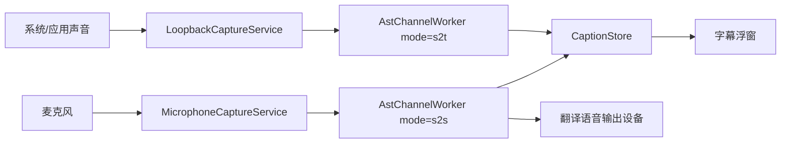

# GameSubRelay 双通道语音翻译设计

日期：2026-04-29  
状态：设计修订稿  
适用阶段：通用 Windows 同声传译定位与 Provider 扩展

## 1. 设计结论

GameSubRelay 的产品定位是通用 Windows 同声传译软件：采集麦克风和系统/应用声音，输出实时字幕、译文和可选翻译语音。当前实现使用火山引擎同声传译 2.0 AST 服务，应用层通过 Provider 接口保留后续接入其他厂商的空间。

核心原因：

- 用户目标不是“只把声音转写出来”，而是把会议、直播、语音聊天、视频或游戏中的语音尽快翻译成可读字幕。
- 火山 AST 服务已经覆盖识别、翻译、字幕和可选目标语音输出，适合同时承载麦克风和系统/应用声音两路通道。
- 纯 ASR 保留为诊断和后续“只转写”能力，不作为系统声音字幕主链路。

目标架构：

| 通道 | 输入 | AST 模式 | 输出 | 用户场景 |
| --- | --- | --- | --- | --- |
| 我的语音输出 | 麦克风 | `s2s` | 原文字幕、译文字幕、翻译后语音 | 我说中文，生成英文语音给对方听 |
| 系统声音字幕 | 系统/应用声音 loopback | `s2t` | 原文字幕、译文字幕 | 把播放设备里的语音翻译成我能读懂的字幕 |

## 2. 官方文档依据

官方文档入口：

- 火山引擎同声传译 2.0 API 接入文档：https://www.volcengine.com/docs/6561/1756902?lang=zh
- 火山引擎语音同传大模型产品简介：https://www.volcengine.com/docs/6561/1631605?lang=zh

本地业务协议依据：

- `C:\Users\pilil\Downloads\protos\protos\products\understanding\ast\ast_service.proto`
- `C:\Users\pilil\Downloads\ast_python_client\ast_python\ast_demo.py`

关键协议点：

- WebSocket 地址：`wss://openspeech.bytedance.com/api/v4/ast/v2/translate`
- Resource ID：`volc.service_type.10053`
- 鉴权 Header：
  - `X-Api-App-Key`
  - `X-Api-Access-Key`
  - `X-Api-Resource-Id`
  - `X-Api-Connect-Id`
- 客户端事件：
  - `StartSession`
  - `TaskRequest`
  - `FinishSession`
- 服务端事件：
  - `SessionStarted`
  - `SessionFinished`
  - `SessionFailed`
  - `UsageResponse`
  - `AudioMuted`
  - `SourceSubtitleStart`
  - `SourceSubtitleResponse`
  - `SourceSubtitleEnd`
  - `TranslationSubtitleStart`
  - `TranslationSubtitleResponse`
  - `TranslationSubtitleEnd`
  - `TTSSentenceStart`
  - `TTSResponse`
  - `TTSSentenceEnd`

## 3. 模式语义

### `s2t`

`s2t` 用于语音到翻译文本。服务接收源语言音频，返回源字幕和译文字幕，不要求返回目标语音。

适合“系统声音字幕”：

- 不播放翻译音频，避免和原声、会议音频、语音聊天或视频声音互相干扰。
- 字幕浮窗显示原文和译文。
- 延迟优先级高，字幕应尽快显示 interim，再用 final 覆盖。

### `s2s`

`s2s` 用于语音到翻译语音。服务接收源语言音频，返回源字幕、译文字幕和目标语音数据。

适合“我的语音输出”：

- 麦克风输入通过 AST 翻译。
- 目标音频输出到用户指定播放设备或虚拟声卡。
- 字幕浮窗也显示原文和译文，便于确认自己说的话和译文是否正确。

## 4. 多语言设计

软件不能写死英语到中文或中文到英文。每个通道都需要独立语言配置。

建议内置语言选项：

| 显示名 | AST 语言码 |
| --- | --- |
| 中文 | `zh` |
| 英文 | `en` |
| 中英混说 | `zhen` |
| 日语 | `ja` |
| 印尼语 | `id` |
| 西班牙语 | `es` |
| 葡萄牙语 | `pt` |
| 德语 | `de` |
| 法语 | `fr` |

校验规则：

- 源语言和目标语言不能完全相同，除非是文档明确要求的特殊模式。
- `zhen` 用于中英混说场景，源语言和目标语言应同时使用 `zhen`。
- 非中英互译时，优先要求源语言或目标语言至少一端是中文或英文；如果后续官方开放更多语言对，再放宽校验。
- UI 文案使用“源语言”和“目标语言”，不要写“中文/英文固定方向”。

## 5. 配置模型

建议把当前分散的“同声传译”和“语音识别”配置合并成 AST 通道配置。

```csharp
public sealed record AstChannelSettings(
    bool Enabled,
    string InputDeviceId,
    AstChannelMode Mode,
    string SourceLanguage,
    string TargetLanguage,
    string? OutputDeviceId,
    bool PlayTranslatedAudio,
    IReadOnlyList<string> HotWords);

public enum AstChannelMode
{
    SpeechToText,
    SpeechToSpeech
}
```

应用级配置：

```csharp
public sealed record AstSettings(
    string Provider,
    AstChannelSettings Microphone,
    AstChannelSettings SystemAudio);
```

敏感凭据仍放在 DPAPI secret store：

```csharp
public sealed record AstSecretSettings(
    string AppKey,
    string AccessKey,
    string ResourceId);
```

兼容迁移：

- 旧 `TranslationSettings` 迁移到 `AstSettings.Microphone`。
- 旧 `SpeechRecognitionSettings` 不再作为系统声音主路径配置，只作为诊断/开发设置保留。
- 如果旧配置里 `audio.microphoneEnabled=false`，UI 应展示“麦克风通道未启用”，但不影响系统字幕通道。

## 6. 运行时架构

建议把当前 worker 统一为 AST channel worker：



通道启动：

1. 校验凭据、输入设备、语言方向、模式。
2. 创建对应音频采集服务。
3. 创建 AST WebSocket 会话。
4. 发送 `StartSession`。
5. 启动发送循环和读取循环。

通道停止：

1. 停止音频采集。
2. 等待发送循环消费完已采集音频。
3. 发送剩余音频和 `FinishSession`。
4. 等待 `SessionFinished`，或在超时后取消读取。
5. 释放 WebSocket 和音频输出设备。

## 7. 字幕浮窗设计

浮窗只保留上下两个区域：

- 上方：我的语音输出。
- 下方：系统声音字幕。

每个区域内部显示两行：

- 原文。
- 译文。

显示策略：

- 不做滚动字幕。
- 每个通道只显示当前最新片段。
- interim 结果直接覆盖当前行。
- final 结果固定为最终文本，直到下一句话开始。
- 源字幕和译文字幕应按同一 provider sequence 合并。

推荐数据结构：

```csharp
public sealed record ChannelCaptionState(
    AudioChannelId ChannelId,
    string SourceText,
    string TranslatedText,
    SegmentStability Stability,
    DateTimeOffset UpdatedAt);
```

## 8. UI 信息架构

主界面建议改为三个主要区域：

1. **我的语音输出**
   - 开始/停止。
   - 源语言、目标语言。
   - 麦克风设备。
   - 目标语音输出设备。
   - 测试连接、测试 WAV、测试当前设备。

2. **系统声音字幕**
   - 开始/停止。
   - 源语言、目标语言。
   - 系统/应用声音设备。
   - 测试连接、测试 WAV、测试当前设备。

3. **浮窗与全局设置**
   - 浮窗位置、大小、透明度、字号。
   - 快捷键。
   - 日志级别。
   - 凭据管理。

界面命名建议：

- 不再把主功能叫“语音识别”。
- `同声传译` 可以作为产品能力名称保留。
- 操作卡片使用“我的语音输出”和“系统声音字幕”，更贴近通用 Windows 桌面场景。

## 9. ASR 的保留边界

纯 ASR 不删除，但从主流程中移出。

保留用途：

- 测试火山流式识别连接。
- 对比 AST 字幕质量和延迟。
- 未来提供“只转写不翻译”模式。
- 开发诊断页展示原始识别结果。

不再承担：

- 系统声音主字幕链路。
- 翻译字幕生成。

## 10. 分阶段实施计划

### 阶段 1：配置和命名调整

- 新增 `AstChannelSettings`。
- 将旧同传/语音识别配置迁移到 AST 双通道配置。
- README 和设置界面统一使用新概念。

### 阶段 2：系统声音改走 AST `s2t`

- `AppAudioChannelWorkerFactory` 为麦克风创建 `s2s` worker。
- `AppAudioChannelWorkerFactory` 为系统/应用声音创建 `s2t` worker。
- `SpeechRecognitionChannelWorker` 从主启动入口移除。
- 保留 ASR provider 和诊断测试入口。

### 阶段 3：浮窗数据模型改造

- CaptionStore 支持每个通道维护最新原文/译文状态。
- Overlay 不再滚动显示历史字幕。
- 每个通道固定原文和译文两行。

### 阶段 4：测试和日志

- 测试 `s2s` 会发送 target audio 配置。
- 测试 `s2t` 不启动音频输出。
- 测试停止顺序：停止采集、发送 final、等待 SessionFinished。
- 日志区分 `MicAstS2S` 和 `SystemAstS2T`，不要再混用 ASR 命名。

## 11. 验收标准

- 麦克风通道可以中文输入、英文音频输出，同时显示中文原文和英文译文。
- 系统声音通道可以识别播放设备中的语音，并显示原文和译文字幕。
- 两个通道能独立开始和停止，互不影响。
- 系统声音通道停止时不会因为 WebSocket 被提前取消而报错。
- 浮窗只有上下两个区域，每个区域内部是原文和译文两行。
- 语言方向可配置，不写死中英或英中。
- 凭据只从本地配置/DPAPI/环境变量读取，不进入仓库。

## 12. 待确认问题

- `s2s` 返回音频格式最终使用 `pcm` 还是 `ogg_opus`。当前 C# 实现使用 PCM；官方 Python 示例使用 `ogg_opus`。
- 系统声音是否需要可选“只显示译文，不显示原文”。
- 是否需要按应用或进程隔离音频。当前实现仍使用播放设备 loopback，会采集该设备上的所有声音。
- 多语言对的完整支持范围应以后续官方文档和实测结果为准。
