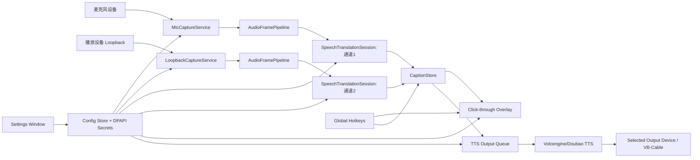

# SubRelay MVP 设计文档

日期：2026-04-29  
状态：设计草案，可进入实施计划  
目标平台：Windows 10/11  

## 1. 背景与目标

> 2026-04-30 定位修订：SubRelay 调整为通用 Windows 桌面同声传译软件。游戏仍是适用场景之一，但产品叙述、设置命名和默认工作流应面向会议、直播、语音聊天、视频播放、游戏等系统/应用音频场景。

SubRelay 是一个 Windows 桌面工具，用于实时采集麦克风和系统/应用声音、调用语音翻译服务完成实时识别与翻译，并用不影响当前操作的字幕浮层显示结果。当前实现使用火山引擎同声传译，架构上通过 Provider 接口为后续接入其他厂商服务保留扩展点。

核心目标：

- 采集玩家麦克风语音。
- 采集系统、监听设备或游戏输出所在播放设备的声音。
- 对两个通道分别实时识别和翻译。
- 在屏幕上用黑色半透明、白字、分通道字幕浮层显示原文和译文。
- 浮层默认鼠标穿透，不拦截点击、拖动、滚轮。
- 通过热键进入编辑模式，允许拖动、缩放、调透明度、字号和显示行数。
- 可选把翻译后的语音合成后输出到真实播放设备或 VB-Cable 一类虚拟声卡。
- 字幕显示和语音输出互相独立，任一功能失败不能拖垮另一功能。

## 2. MVP 范围

第一版交付内容：

- Windows 桌面应用，包含一个设置窗口和一个字幕 Overlay 窗口。
- 两个固定通道：
  - 通道 1：麦克风输入。
  - 通道 2：监听设备、系统音频或游戏音频所在播放设备的 WASAPI loopback 输入。
- 设备选择：
  - 录音设备列表，用于麦克风。
  - 播放设备列表，用于系统/游戏音频 loopback。
  - 播放设备列表，用于翻译语音输出，可选择真实耳机/扬声器或 VB-Cable 的 `CABLE Input`。
- 火山实时语音翻译 Provider：
  - 每个通道独立 WebSocket 会话。
  - 输入音频统一转为 16 kHz、16-bit、单声道 PCM。
  - 每 100-200 ms 发送一包音频。
  - 接收同一片段的原文和译文后更新字幕。
- 豆包/火山 TTS Provider：
  - 对最终确认的译文做语音合成。
  - 输出到用户选择的播放设备。
  - 可独立开关，并可按通道开关。
- Overlay：
  - 始终置顶。
  - 默认点击穿透。
  - 编辑模式可移动、缩放、调透明度、字号、行数。
  - 显示每条字幕的通道、原文、译文和临时/最终状态。
- 基础设置页：
  - API 凭据。
  - 源语言、目标语言。
  - 音频输入/输出设备。
  - Overlay 样式和位置。
  - 快捷键：显示/隐藏、编辑模式、清空字幕。

## 3. 非目标

第一版不做：

- 独占全屏游戏强覆盖保证。
- 游戏进程级音频隔离采集。MVP 使用播放设备级 WASAPI loopback，因此会捕获该设备上的所有声音。
- 离线识别、离线翻译和本地大模型。
- 变声、声纹复刻、实时情绪控制。
- 多于两个输入通道的复杂混音面板。
- Mac、Linux 或移动端支持。
- 自动识别源语言作为默认路径。官方实时语音翻译接口要求配置源语言，MVP 先显式选择源语言，自动识别保留为后续 Provider 能力扩展。

## 4. 技术选型

推荐技术栈：

- .NET 8 或更新 LTS 运行时。
- WPF 作为 Windows 桌面 UI 和 Overlay 基础。
- NAudio 负责音频设备枚举、WASAPI capture、WASAPI loopback、重采样和输出。
- `ClientWebSocket` 或稳定 WebSocket 客户端负责火山接口连接。
- `Microsoft.Extensions.Hosting` 和依赖注入管理后台服务生命周期。
- `System.Text.Json` 保存非敏感配置。
- Windows DPAPI `ProtectedData` 保存 API 密钥、Token 等敏感字段。
- Win32 interop 负责 Overlay 样式、鼠标穿透、全局热键和 DPI/窗口控制。

备选方案对比：

| 方案 | 优点 | 风险 | 结论 |
| --- | --- | --- | --- |
| .NET/WPF + NAudio | Windows 原生、Overlay 和 WASAPI 成熟、开发/调试成本低 | UI 风格需要手工打磨 | MVP 推荐 |
| Tauri + Rust + Web 前端 | 包体小、Rust 音频性能好 | Overlay/Win32/audio 组合实现成本更高 | 后续可评估 |
| Electron + Node native audio | UI 快、生态熟 | 包体大，音频 native 依赖和输出设备选择更脆弱 | 不作为 MVP 首选 |
| C++/Qt | 原生能力强 | 开发周期长，测试和维护成本高 | 不作为 MVP 首选 |

## 5. 总体架构



分层：

- `GameSubRelay.Core`：纯业务模型、配置模型、字幕聚合、通道状态机、Provider 接口。
- `GameSubRelay.Infrastructure`：NAudio 音频、火山 WebSocket、TTS、配置持久化、Windows 热键和 Win32 helper。
- `GameSubRelay.App`：WPF 设置窗口、Overlay 窗口、应用启动和依赖注入。
- `tests`：Core 单元测试、Infrastructure 可替换依赖测试、关键 UI ViewModel 测试。

## 6. 数据模型

核心模型：

```csharp
public enum AudioChannelId
{
    Microphone = 1,
    Monitor = 2
}

public enum SegmentStability
{
    Interim,
    Final
}

public sealed record AudioFrame(
    AudioChannelId ChannelId,
    byte[] Pcm16Mono16Khz,
    TimeSpan CapturedAt,
    TimeSpan Duration);

public sealed record TranslationSegment(
    AudioChannelId ChannelId,
    long ProviderSequence,
    string SourceLanguage,
    string TargetLanguage,
    string SourceText,
    string TranslatedText,
    SegmentStability Stability,
    TimeSpan BeginTime,
    TimeSpan EndTime);

public sealed record CaptionLine(
    Guid Id,
    AudioChannelId ChannelId,
    string ChannelLabel,
    string SourceText,
    string TranslatedText,
    SegmentStability Stability,
    DateTimeOffset UpdatedAt);
```

字幕聚合规则：

- Provider 返回事件先按 `ChannelId + ProviderSequence` 分组。
- 同一 `Sequence` 内分别缓存源语言文本和目标语言文本。
- `Definite=false` 更新当前临时字幕行。
- `Definite=true` 将字幕行标记为最终结果。
- 当目标语言文本比源语言晚到时，Overlay 先显示源文本，再补译文。
- `CaptionStore` 只保留用户配置的最大行数，默认 6 行。

## 7. 音频采集设计

### 麦克风通道

- 使用 NAudio 的 WASAPI capture 读取用户选择的录音设备。
- 启动前检查设备可用状态、采样率、通道数。
- 将输入统一转换为 16 kHz、16-bit、单声道 PCM。
- 以 100-200 ms 帧送入对应翻译会话。
- 音量过低时仍发送音频，MVP 不使用激进 VAD，避免漏掉轻声说话。

### 监听/系统音频通道

- 使用 NAudio 的 WASAPI loopback 读取用户选择的播放设备。
- MVP 的语义是“捕获该播放设备上的混音输出”，不是“只捕获某个游戏进程”。
- 如果用户希望只捕获游戏或队友语音，推荐通过游戏、Discord 或系统混音把目标声音路由到单独播放设备或虚拟声卡。
- 如果翻译语音输出设备与 loopback 采集设备相同，应用显示反馈风险提示，因为合成语音可能再次被采集并翻译。

### 音频格式

火山实时语音翻译官方文档要求实时语音输入为 16 kHz、16-bit、单声道，wav 或 pcm，音频内容 base64 编码，并建议 100-200 ms 发送一包。因此内部音频总线统一用 PCM16 mono 16 kHz，避免 Provider 层重复处理格式差异。

## 8. 火山/豆包 Provider 设计

### 实时语音翻译

截至 2026-04-29 查阅的火山官方文档，实时语音翻译 API：

- WebSocket 地址：`wss://translate.volces.com/api/translate/speech/v1/`
- Action：`SpeechTranslate`
- Version：`2020-06-01`
- 建连后先发送 `Configuration`，包含源语言和目标语言。
- 之后发送 base64 音频包。
- 返回 `Subtitle`，包含 `Text`、`Language`、`Sequence`、`Definite`、时间戳等字段。

MVP Provider 约定：

- 每个输入通道对应一个独立 WebSocket 会话。
- 一次配置变更会重建对应通道会话。
- 网络断开后指数退避重连，重连期间 Overlay 显示该通道状态为“重连中”。
- `-401`、`-403` 等鉴权错误不自动重试，提示用户检查凭据或服务权限。
- `-429` 限流错误进入冷却期，避免密集重连。
- 收到 `Definite=true` 的译文后才进入 TTS 队列；Overlay 可以显示 `Definite=false` 的临时字幕。

### TTS 输出

截至 2026-04-29 查阅的豆包语音官方文档，在线语音合成 WebSocket 接口使用：

- 地址：`wss://openspeech.bytedance.com/api/v1/tts/ws_binary`
- Header 使用 Bearer Token。
- 请求 JSON 内包含 appid 等信息。
- 二进制协议返回音频片段。
- 官方文档说明单条连接单次合成，MVP 按“一段最终译文一次合成”的方式建连或复用受控连接池。

MVP TTS 策略：

- 仅处理最终译文，避免临时字幕导致重复播报。
- 每个通道有独立开关，默认关闭。
- 输出队列有最大长度，默认 3 条；超过时丢弃最旧的待播报段，避免翻译语音严重滞后。
- 字幕和 TTS 解耦：TTS 失败只更新状态，不影响字幕。
- 输出设备必须是 Windows 播放设备。若要把翻译语音送进游戏或 Discord，用户选择 VB-Cable 的播放端，例如 `CABLE Input`，再在目标软件中选择对应录音端，例如 `CABLE Output`。

## 9. Overlay 设计

窗口行为：

- WPF 无边框透明窗口。
- `Topmost=true`，普通桌面合成层置顶。
- 游玩模式设置 Win32 扩展样式：
  - `WS_EX_LAYERED`
  - `WS_EX_TRANSPARENT`
  - `WS_EX_TOOLWINDOW`
- 编辑模式移除 `WS_EX_TRANSPARENT`，显示边框、拖动手柄和设置浮条。
- 切回游玩模式时隐藏编辑控件并恢复鼠标穿透。

视觉样式：

- 黑色半透明背景，默认透明度 65%。
- 白色主文字，译文可用稍大或稍亮权重。
- 每条字幕显示通道标签，例如 `Mic`、`Game`。
- 原文和译文分两行，原文较小，译文较大。
- 临时字幕可用较低透明度或末尾省略号；最终字幕恢复正常透明度。
- 默认显示 6 行，用户可设置 1-12 行。

交互：

- `显示/隐藏` 热键切换 Overlay 可见性。
- `编辑模式` 热键切换鼠标穿透状态。
- `清空字幕` 热键清空 `CaptionStore`。
- 编辑模式下拖动窗口主体移动位置。
- 编辑模式下拖动边缘调整大小。
- 编辑模式下可直接调透明度、字号、行数。

兼容性边界：

- 无边框窗口化、窗口化全屏游戏为 MVP 目标。
- 独占全屏可能覆盖不到，应用在设置页明确提示。
- 不注入游戏进程，不使用图形 API hook，降低与反作弊冲突的概率。

## 10. 设置与配置

配置文件：

- 非敏感配置：`%APPDATA%\SubRelay\settings.json`
- 敏感配置：`%APPDATA%\SubRelay\secrets.json.dpapi`

敏感字段使用 DPAPI `CurrentUser` 范围加密，不能明文写入日志。

主要配置结构：

```json
{
  "audio": {
    "microphoneDeviceId": "",
    "monitorRenderDeviceId": "",
    "ttsOutputRenderDeviceId": "",
    "microphoneEnabled": true,
    "monitorEnabled": true,
    "ttsEnabled": false,
    "ttsForMicrophone": false,
    "ttsForMonitor": false
  },
  "translation": {
    "provider": "VolcengineSpeechTranslate",
    "sourceLanguage": "en",
    "targetLanguage": "zh",
    "region": "cn-north-1"
  },
  "overlay": {
    "left": 120,
    "top": 720,
    "width": 760,
    "height": 220,
    "opacity": 0.65,
    "fontSize": 22,
    "maxLines": 6,
    "visible": true
  },
  "hotkeys": {
    "toggleOverlay": "Ctrl+Alt+S",
    "toggleEditMode": "Ctrl+Alt+E",
    "clearCaptions": "Ctrl+Alt+C"
  }
}
```

凭据结构：

```json
{
  "volcengine": {
    "accessKeyId": "",
    "secretAccessKey": "",
    "ttsAppId": "",
    "ttsToken": "",
    "ttsCluster": ""
  }
}
```

设置页分区：

- 音频输入：麦克风、监听/系统音频设备、输入状态。
- 翻译服务：火山凭据、连接测试、源语言、目标语言。
- 字幕浮层：位置、大小、透明度、字号、行数、预览。
- 语音输出：启用开关、输出设备、按通道开关、队列策略说明。
- 快捷键：显示/隐藏、编辑模式、清空字幕，带冲突提示。

## 11. 状态与错误处理

每个通道维护独立状态：

- `Stopped`
- `Starting`
- `Capturing`
- `Translating`
- `Reconnecting`
- `Error`

常见错误处理：

- 输入设备不存在：通道不启动，设置页提示重新选择设备。
- 设备被占用：提示用户关闭占用程序或更换设备。
- API 鉴权失败：停止 Provider，提示检查 AK/SK、Token、服务开通状态。
- 网络断开：保留已有字幕，通道自动退避重连。
- Provider 限流：进入冷却期，提示用户降低通道数或检查配额。
- TTS 输出设备不可用：关闭 TTS 输出，字幕继续工作。
- Overlay 热键注册失败：提示冲突，并要求用户换快捷键。

日志策略：

- 默认记录状态、错误码、设备 ID、连接生命周期。
- 默认不记录完整音频、不记录完整字幕文本。
- 调试模式可临时记录字幕事件，但需要显式打开，并在 UI 中提示隐私风险。

## 12. 性能与延迟目标

MVP 目标：

- 音频采集帧：100-200 ms。
- Overlay 临时字幕更新：收到 Provider 事件后 100 ms 内反映到 UI。
- 从说话到临时字幕：网络正常时目标 1-2 秒内。
- 从最终译文到 TTS 开始播放：目标 1 秒内开始排队播放。
- CPU 占用：双通道采集和 Overlay 空闲状态下保持轻量，避免影响游戏帧率。

实现约束：

- 音频采集、Provider 网络、TTS 合成全部在后台任务运行。
- UI 线程只做 ViewModel 更新和渲染。
- 使用有界 Channel/队列，防止网络抖动时内存无限增长。

## 13. 测试策略

单元测试：

- 配置读写和 DPAPI wrapper 的可替代实现。
- 热键字符串解析和冲突检测。
- 字幕聚合：乱序、先源文后译文、先译文后源文、临时转最终。
- TTS 队列：最大长度、丢弃策略、按通道开关。

集成测试：

- 使用 fake audio frame source 模拟双通道输入。
- 使用 fake translation provider 产生确定字幕事件。
- 使用 fake TTS provider 验证字幕与语音输出解耦。

手动验证：

- Windows 10/11 上枚举麦克风和播放设备。
- 麦克风通道可产生字幕。
- 播放设备 loopback 可产生字幕。
- Overlay 在游玩模式不可点击。
- 编辑模式可拖动、缩放、调透明度、字号和行数。
- 热键在设置窗口无焦点时可触发。
- 输出到真实耳机可听到 TTS。
- 输出到 VB-Cable 后，Discord 或游戏可选择对应虚拟录音端。

## 14. 风险与缓解

| 风险 | 影响 | 缓解 |
| --- | --- | --- |
| WASAPI loopback 捕获整个播放设备 | 可能采到音乐、游戏、TTS 自身输出 | 设置页明确设备级语义，检测同设备输入输出并提示反馈风险 |
| Overlay 与反作弊冲突 | 游戏可能拦截置顶窗口或禁止覆盖 | 不注入、不 hook，只用普通窗口；首版声明窗口化/无边框目标 |
| 火山接口配额或鉴权复杂 | 用户初次配置失败率高 | 设置页提供连接测试、错误码解释和凭据分区 |
| 双通道同时翻译成本较高 | API 成本和限流风险 | 每通道可独立开关，显示实时状态和错误 |
| TTS 输出滞后 | 语音和字幕不同步 | 只播最终译文，限制队列长度，过期段丢弃 |
| 自动源语言需求与接口限制冲突 | 用户期望自动识别 | MVP 明确显式源语言，后续通过额外 Provider 或前置语言检测扩展 |

## 15. 后续扩展

- 多通道输入和自定义通道标签。
- 进程级音频捕获或应用音频捕获。
- 源语言自动识别。
- Provider 插件化，支持 OpenAI、Azure、Google、DeepL 或本地模型。
- 字幕历史记录和导出。
- OCR/屏幕字幕翻译。
- 更精细的 TTS 声音、语速、音量和按语言音色配置。
- 游戏预设配置，例如不同游戏不同 Overlay 位置和快捷键。

## 16. API 参考

- 火山引擎实时语音翻译 API：<https://www.volcengine.com/docs/4640/127504>
- 豆包语音在线语音合成 WebSocket 接口：<https://www.volcengine.com/docs/6561/79821>
